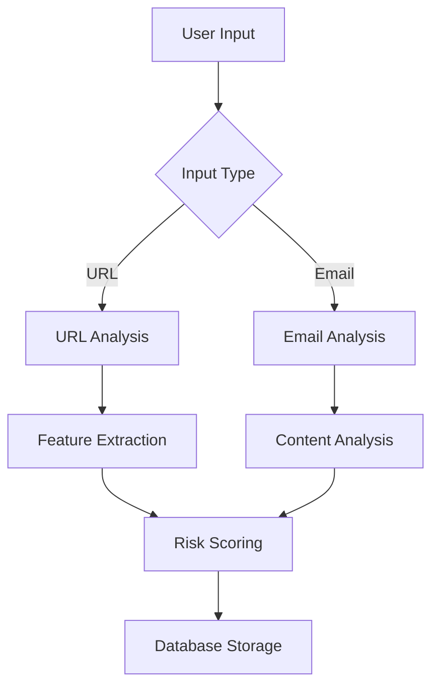
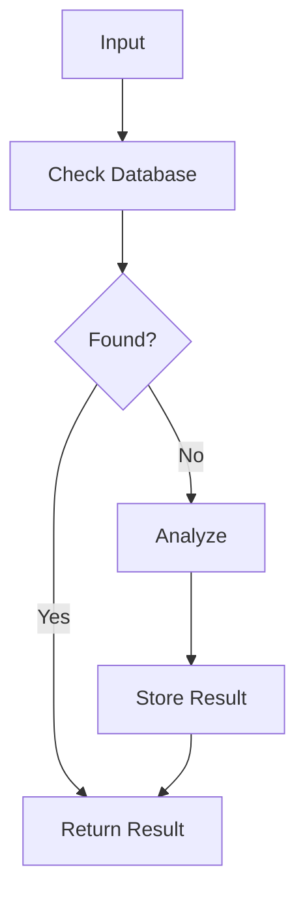

# PhishDefender

## Table of Contents
1. [Project Overview](#1-project-overview)
2. [Installation & Setup](#2-installation--setup)
3. [Project Structure](#3-project-structure)
4. [Technical Architecture](#4-technical-architecture)
5. [Features & Functionality](#5-core-functionality)
6. [API Documentation](#6-api-documentation)
7. [Screenshots Guide](#7-screenshots-guide)
8. [Security Measures](#8-security-measures)
9. [Error Handling](#9-error-handling)
10. [Deployment Guide](#10-deployment-guide)
11. [Testing Guidelines](#11-testing-guidelines)
12. [Maintenance](#12-maintenance)
13. [Detailed Component Analysis](#13-detailed-component-analysis)
14. [Implementation Details & Troubleshooting](#14-implementation-details)
15. [Contact ME](#15-contact-me)

## 1. Project Overview
PhishDefender is a comprehensive web application designed to detect and analyze potential phishing URLs, domains, and emails using machine learning, AI content analysis, and multiple data sources for accurate phishing detection.

### Core Features
- URL and domain analysis
- Email content analysis
- Real-time phishing detection
- Historical data tracking
- API Access
- Statistical reporting

## 2. Installation & Setup

### 2.1 Prerequisites
```bash
# Python 3.8+ required
python --version

# MongoDB installation required
mongod --version

# Verify TensorFlow installation
python -c "import tensorflow as tf; print(tf.__version__)"

# Download DistilBERT model (will be done automatically on first run)
python -c "from transformers import pipeline; classifier = pipeline('text-classification', model='distilbert-base-uncased')"
```

### 2.1.1 Hardware Requirements
```text
Hardware Requirements:
- Minimum 8GB RAM (16GB recommended)
- CPU: Modern multi-core processor
- GPU: Optional, but recommended for faster processing
- Storage: At least 2GB free space for model downloads
```

### 2.2 Dependencies Installation
```bash
pip install -r requirements.txt
```

### 2.3 Required Dependencies
```txt
flask==2.0.1
pymongo==4.0.1
requests==2.26.0
beautifulsoup4==4.9.3
dnspython==2.1.0
python-whois==0.7.3
transformers==4.11.3
openai==1.0.0
tensorflow>=2.0.0
transformers>=4.11.3
torch>=1.9.0  
```

### 2.4 Configuration Setup
Create a `.env` file with the following:
```env
FLASK_APP=webapp.py
FLASK_ENV=development
SECRET_KEY=your_secret_key
MONGODB_URI_PHISH_LINKS=your_mongodb_uri
MONGODB_URI_PHISHING_URLS=your_mongodb_uri
OPENAI_API_KEY=your_openai_api_key
```

### 2.4.1Environment Setup
```bash
# Optional: TensorFlow configuration
export TF_ENABLE_ONEDNN_OPTS=0  # If you want to disable oneDNN optimizations
export CUDA_VISIBLE_DEVICES=0    # If using GPU
```

### 2.5 Running the Application
```bash
# Start the Flask application
python web_app.py

# Access the application
# Open browser: http://localhost:5000
```

## 3. Project Structure

```
PhishDefender/
├── web_app.py              # Main application file
├── requirements.txt        # Project dependencies
├── static/                # Static assets
│   ├── API-Log.txt        # API request logs
│   ├── icon.png          # 225,276 bytes
│   └── ticon.svg         # 2,608 bytes
├── templates/            # HTML templates
│   ├── index.html       # Main interface
│   ├── analysis.html    # Analysis results
│   ├── api.html         # API documentation
│   ├── email_analysis.html
│   ├── error.html
│   ├── result.html
│   ├── stats.html
│   └── unknown.html
└── screenshots/         # UI documentation
```

## 4. Technical Architecture

### 4.1 Backend Components
- Flask web framework
- MongoDB database clusters
- GPT-4 integration
- DNS analysis system
- WHOIS lookup system

### 4.2 Frontend Components
- Responsive HTML templates
- Bootstrap styling
- Interactive UI elements
- Real-time analysis display

### 4.3 Database Architecture
Two MongoDB clusters:

1. phish-links-domains Cluster
   ```
   Database: phish_defender
   Collections:
   - phishing_domains (Known malicious)
   - phishing_links (Known malicious URLs)
   - s_domains (Safe domains)
   - s_links (Safe URLs)
   ```

2. phishing-urls Cluster
   ```
   Databases:
   1. phish_defender
      - Collection: phishing_urls (Legacy)
   2. phishing_urls
      - Collection: phishing_urls (New)
   ```

## 5. Core Functionality

### 5.1 URL Analysis Process
1. Feature Extraction
   - URL structure analysis
   - Domain age verification
   - TLD analysis
   - Pattern matching

2. DNS Analysis
   - Record verification
   - MX record validation
   - Suspicious pattern detection

3. Content Analysis
   - GPT-4 powered analysis
   - Form detection
   - Input field analysis
   - Brand impersonation detection

### 5.2 Email Analysis
1. Content Analysis
   - Urgency detection
   - Brand impersonation
   - Sensitive info requests
   - Pressure tactics

2. URL Extraction
   - Pattern matching
   - Individual URL analysis
   - Risk scoring

## 6. API Documentation
[Check API Tested Logs Here](https://github.com/mynenivarun/PhishDefender/blob/main/static/API-Log.txt)
### 6.1 Check Endpoint
```bash
POST /api/check
Content-Type: application/json

# URL Check
{
    "url": "https://example.com"
}

# Email Check
{
    "email_content": "Email content here"
}
```

### 6.2 Report Endpoint
```bash
POST /api/report
Content-Type: application/json

{
    "url": "https://example.com",
    "type": "phishing"  # or "safe"
}
```

## 7. Screenshots Guide

### 7.1 Web Interface
- Home.png: Main interface
- 
- API.png: API documentation
- 
- STATS-1.png & STATS-2.png: Statistics dashboard
- 
- 

### 7.2 URL Analysis Examples
1. Known URL Testing
   - N-Knwn_URL_Check.png: Testing known unsafe URL
   - 
   - N-Knwn_URL_Check-Result.png: Results known unsafe URL
   - 
   - P-Knwn_URL_Check.png: Testing known safe URL
   - 
   - P-Knwn_URL_Check-Result.png: Results known safe URL
   - 

2. Unknown URL Analysis
   - N-UnKnwn_URL_Check.png: Testing unknown unsafe URL
   - 
   - N-UnKnwn_URL_Check-Result.png: Results of tested unknown unsafe URL
   - 
   - N-UnKnwn_URL_Check-Result-Analysis.png: 1 Analysis of tested unknown unsafe URL
   - 
   - N-UnKnwn_URL_Check-Result-Analysiss.png: 2 Analysis of tested unknown unsafe URL
   - 
   - P-UnKnwn_URL_Check.png: Testing unknown safe URL
   - 
   - P-UnKnwn_URL_Check-Result.png: Results of tested unknown safe URL
   - 
   - P-UnKnwn_URL_Check-Result-Analysis.png: 1 Analysis of tested unknown safe URL
   - 
   - P-UnKnwn_URL_Check-Result-Analysiss.png: 2 Analysis of tested unknown safe URL
   - 

### 7.3 Email Analysis
- Email_Check.png: Email analysis interface
- 
- Email_Check-Result.png: Analysis results
- 
- Email_Check-Resultt.png: 1 Continuation screenshots showing detailed analysis
- 
- Email_Check-Resulttt.png: 2 Continuation screenshots showing detailed analysis
- 
- Email_Check-Resultttt.png: 2 Continuation screenshots showing detailed analysis
- 

### 7.4 API Testing
- API-Check-Known-URL.png: API URL testing for both unsafe and safe URLs
- 
- API-Report-Safe-URL&Check.png: Safe URL reporting & Checking
- 
- API-Report-UnSafe-URL&Check.png: UnSafe URL reporting & Checking
- 
- API-Check-Safe-Mail.png: Safe Email analysis via API
- 
- API-Check-UnSafe-Mail.png: UnSafe Email analysis via API
- 
- API-Report-Email.png: Reporting an Email via API
- 

## 8. Security Measures

### 8.1 Database Security
- Connection pooling
- Secure URI handling
- Index optimization
- Access control

### 8.2 API Security
- Rate limiting
- Input validation
- Error handling
- Secure key management

### 8.3 Application Security
- Secret key management
- Session handling
- Input sanitization
- Error logging

## 9. Error Handling

### 9.1 Database Errors
```python
try:
    # Database operations
except Exception as e:
    print(f"Database error: {str(e)}")
    raise
```

### 9.2 API Errors
```python
@app.errorhandler(404)
def not_found_error(error):
    return render_template('error.html', 
                         error="404 - Not Found"), 404
```

## 10. Deployment Guide

### 10.1 Production Setup
1. Set environment variables
2. Configure MongoDB clusters
3. Setup OpenAI API
4. Configure DNS settings

### 10.2 Requirements
- Python 3.8+
- MongoDB 4.4+
- OpenAI API access
- DNS resolver access

### 10.3 Monitoring
- Database connection status
- API response times
- Error logging
- Usage statistics

## 11. Testing Guidelines

### 11.1 URL Testing
1. Known safe URLs
2. Known phishing URLs
3. Unknown URLs
4. Edge cases

### 11.2 Email Testing
1. Safe emails
2. Phishing emails
3. Mixed content
4. Large content

## 12. Maintenance

### 12.1 Database Maintenance
- Index optimization
- Connection pooling
- Cache management
- Backup procedures

### 12.2 Performance Optimization
- Query optimization
- Response caching
- Connection management
- Resource utilization

## 13. Detailed Component Analysis

### 13.1 URL Analysis Engine
```python
class PhishingAnalyzer:
    def analyze_url(self, url):
        # Complete analysis workflow
        features = self.extract_url_features(url)
        domain = urlparse(url).netloc
        dns_checks = self.check_dns_records(domain)
        content_analysis = self.analyze_content(url)
```

#### Features Analyzed:
1. URL Structure
   - Length
   - Number of dots
   - IP-based URLs
   - Suspicious TLDs
   - Subdomain count

2. Domain Analysis
   - Age verification
   - WHOIS information
   - Registration details
   - Historical data

3. Content Checks
   - Form detection
   - Input field analysis
   - Link patterns
   - Security indicators

### 13.1.1 AI/ML Integration

#### TensorFlow Setup
```python
# TensorFlow Configuration
import tensorflow as tf

# TensorFlow Configuration Messages
"""
2024-11-21 04:44:13.176985: I tensorflow/core/util/port.cc:153] oneDNN custom operations are on. 
You may see slightly different numerical results due to floating-point round-off errors from different computation orders. 
To turn them off, set the environment variable `TF_ENABLE_ONEDNN_OPTS=0`.
"""
```

#### DistilBERT Integration
```python
# Initialize AI models
try:
    # Initialize DistilBERT classifier
    from transformers import pipeline
    classifier = pipeline("text-classification", model="distilbert-base-uncased")
    print("AI models initialized successfully")
except Exception as e:
    print(f"Error initializing AI models: {e}")
    classifier = None

"""
Initialization Messages:
Some weights of DistilBertForSequenceClassification were not initialized from the model checkpoint 
at distilbert-base-uncased and are newly initialized: 
['classifier.bias', 'classifier.weight', 'pre_classifier.bias', 'pre_classifier.weight']
"""
```

#### Model Usage
The DistilBERT model is used for:
1. Text classification of URL content
2. Phishing content detection
3. Suspicious pattern recognition

### 13.2 Email Analysis System
```python
class ContentAnalyzer:
    def analyze_email(self, email_content):
        # Email analysis components
        urls = self.extract_urls(email_content)
        threat_indicators = self.analyze_indicators(email_content)
        url_analysis = self.analyze_urls(urls)
```

#### Analysis Components:
1. Content Indicators
   - Urgency language
   - Sensitive requests
   - Pressure tactics
   - Brand impersonation

2. URL Extraction
   - Pattern matching
   - URL validation
   - Domain extraction

3. Threat Scoring
   - Indicator weights
   - Combined analysis
   - Risk calculation

### 13.3 Database Operations

#### 1. Collection Management
```python
def get_db_connections():
    # Initialize database connections
    g.urls_client = MongoClient(MONGODB_URIS['phishing_urls'])
    g.links_domains_client = MongoClient(MONGODB_URIS['phish_links_domains'])
```

#### 2. Data Storage
```python
def store_analysis_result(url, domain, is_phishing, analysis_data):
    # Store in appropriate collections based on analysis
    if is_phishing:
        store_phishing_data(url, domain, analysis_data)
    else:
        store_safe_data(url, domain, analysis_data)
```

### 13.4 Web Interface Components

#### 1. Main Interface (index.html)
```html
<div class="analysis-form">
    <!-- URL Analysis Tab -->
    <div class="url-analysis">
        <input type="url" class="form-control" placeholder="Enter URL">
        <button class="btn btn-primary">Analyze</button>
    </div>

    <!-- Email Analysis Tab -->
    <div class="email-analysis">
        <textarea class="form-control" placeholder="Paste email content"></textarea>
        <button class="btn btn-primary">Analyze</button>
    </div>
</div>
```

#### 2. Results Display (analysis.html)
```html
<div class="results-container">
    <!-- Risk Score Display -->
    <div class="risk-score">
        {{ risk_score }}
    </div>

    <!-- Feature Analysis -->
    <div class="features-list">
        
            <div class="feature-item">
                {{ feature.name }}: {{ feature.value }}
            </div>
        
    </div>
</div>
```

### 13.5 API Implementation
[Check API Tested Logs Here](https://github.com/mynenivarun/PhishDefender/blob/main/static/API-Log.txt)
#### 1. Check Endpoint
```python
@app.route('/api/check', methods=['POST'])
def api_check_url():
    try:
        data = request.get_json()
        url = data['url']
        domain = urlparse(url).netloc
        
        # Check existing records
        result = check_url_in_all_collections(url, domain)
        
        if result:
            return jsonify(result)
            
        # Perform new analysis
        analysis = perform_analysis(url)
        store_analysis_result(analysis)
        return jsonify(analysis)
        
    except Exception as e:
        return jsonify({"error": str(e)}), 500
```

#### 2. Report Endpoint
```python
@app.route('/api/report', methods=['POST'])
def api_report():
    try:
        data = request.get_json()
        store_report(data)
        return jsonify({"status": "success"})
    except Exception as e:
        return jsonify({"error": str(e)}), 500
```

### 13.6 Screenshot Analysis

#### Home Page (Home.png)
- Clean, intuitive interface
- Dual-mode analysis options
- Clear navigation structure
- Responsive design elements

#### Analysis Results (N-UnKnwn_URL_Check-Result-Analysis.png)
- Comprehensive result display
- Feature breakdown
- Risk indicators
- Visual risk scoring

#### Statistics Dashboard (STATS-1.png, STATS-2.png)
- Overall statistics
- Recent detections
- Distribution charts
- Historical data

### 13.7 Data Flow

1. Input Processing


2. Analysis Flow


### 13.8 Configuration Management

#### Environment Variables
```python
app.config.from_object({
    'SECRET_KEY': os.getenv('SECRET_KEY'),
    'MONGODB_URI': os.getenv('MONGODB_URI'),
    'OPENAI_API_KEY': os.getenv('OPENAI_API_KEY')
})
```

#### Database Configuration
```python
MONGODB_URIS = {
    'phish_links_domains': "mongodb_uri_1",
    'phishing_urls': "mongodb_uri_2"
}
```

### 13.9 Error Handling

#### Database Errors
```python
def handle_db_error(error):
    log_error(error)
    notify_admin(error)
    return render_template('error.html', error=str(error))
```

#### API Errors
```python
def handle_api_error(error):
    return jsonify({
        'error': str(error),
        'status': 'error',
        'code': error.code
    }), error.code
```

### 13.10 Testing Procedures

1. URL Testing Matrix
```
-----------------------------------------
| Test Case          | Expected Result |
|--------------------|-----------------|
| Known Safe URL     | Safe            |
| Known Phishing URL | Unsafe          |
| New URL            | Analysis Result |
| Malformed URL      | Error Handler   |
-----------------------------------------
```

2. Email Testing Matrix
```
-----------------------------------------
| Test Case           | Expected Result |
|---------------------|-----------------|
| Clean Email         | Safe            |
| Phishing Email      | Unsafe          |
| Mixed Content       | Analysis Result |
| Multiple URLs       | Multiple Checks |
-----------------------------------------
```

## 14. Implementation Details & Troubleshooting

### 14.1 Machine Learning Components

#### GPT-4 Integration
```python
def analyze_content(self, content):
    """GPT-4 powered content analysis"""
    try:
        response = self.client.chat.completions.create(
            model="gpt-4",
            messages=[
                {"role": "system", "content": "Analyze for phishing indicators"},
                {"role": "user", "content": content}
            ]
        )
        return response.choices[0].message.content
    except Exception as e:
        return f"Analysis error: {str(e)}"
```

#### DistilBERT Classification
```python
# Initialize AI models
try:
    classifier = pipeline("text-classification", 
                        model="distilbert-base-uncased")
    print("AI models initialized successfully")
except Exception as e:
    print(f"Error initializing AI models: {e}")
    classifier = None
```

### 14.2 Database Schema Definitions

#### Phishing URLs Collection
```json
{
    "url": "string",
    "domain": "string",
    "result": "integer",
    "risk_score": "float",
    "features": {
        "length": "integer",
        "num_dots": "integer",
        "has_ip": "boolean",
        "has_suspicious_words": "boolean",
        "is_https": "boolean",
        "domain_age": "integer"
    },
    "analysis_date": "datetime"
}
```

#### Known Domains Collection
```json
{
    "domain": "string",
    "date_added": "datetime",
    "verified": "boolean",
    "last_checked": "datetime",
    "source": "string"
}
```

### 14.3 API Usage Examples
[Check API Tested Logs Here](https://github.com/mynenivarun/PhishDefender/blob/main/static/API-Log.txt)
#### 1. URL Check Example
```bash
# Windows PowerShell
curl -X POST -H "Content-Type: application/json" -d "{\"url\": \"https://example.com\"}" http://localhost:5000/api/check

# Response
{
    "url": "https://example.com",
    "is_phishing": false,
    "risk_score": 0.2,
    "features": {...},
    "analysis_date": "2024-12-07T..."
}
```

#### 2. Email Check Example
```bash
# Windows PowerShell
curl -X POST -H "Content-Type: application/json" -d "{\"email_content\": \"Suspicious email content...\"}" http://localhost:5000/api/check

# Response
{
    "threat_level": 0.8,
    "threat_level_text": "High Risk",
    "findings": [...],
    "urls_found": [...]
}
```

### 14.4 Performance Optimization

#### Database Indexing
```python
def create_mongodb_indexes():
    """Create necessary indexes for all collections"""
    try:
        # URLs collection indexes
        g.urls_collection.create_index([("url", 1)], unique=True)
        g.urls_collection.create_index([("domain", 1)])
        g.urls_collection.create_index([("analysis_date", -1)])

        # Domains collection indexes
        g.phishing_domains.create_index([("domain", 1)], unique=True)
        g.safe_domains.create_index([("domain", 1)], unique=True)
    except Exception as e:
        print(f"Error creating indexes: {str(e)}")
```

#### Connection Pooling
```python
def get_db_connections():
    if 'db_connections' not in g:
        try:
            g.db_connections = {
                'urls': MongoClient(MONGODB_URIS['phishing_urls']),
                'links_domains': MongoClient(MONGODB_URIS['phish_links_domains'])
            }
```

### 14.5 Security Implementation

#### Input Validation
```python
def validate_url(url):
    """Validate URL format and structure"""
    try:
        result = urlparse(url)
        return all([result.scheme, result.netloc])
    except Exception:
        return False
```

#### API Key Management
```python
def verify_api_key():
    """Verify API key in request headers"""
    api_key = request.headers.get('X-API-Key')
    if not api_key:
        return jsonify({"error": "No API key provided"}), 401
    # Verify key against secure storage
```

### 14.6 Deployment Checklist

1. Environment Setup
```bash
# Create virtual environment
python -m venv venv
source venv/bin/activate  # Linux/Mac
.\venv\Scripts\activate   # Windows

# Install dependencies
pip install -r requirements.txt
```

2. Configuration
```bash
# Set environment variables
export FLASK_APP=web_app.py
export FLASK_ENV=production
export SECRET_KEY=your_secret_key
export MONGODB_URI_1=your_uri_1
export MONGODB_URI_2=your_uri_2
export OPENAI_API_KEY=your_api_key
```

3. Database Setup
```python
# Verify connections
def verify_connections():
    try:
        # Test each connection
        for client in g.db_connections.values():
            client.admin.command('ping')
        return True
    except Exception as e:
        return False
```

### 14.7 Monitoring and Maintenance

#### 1. Health Checks
```python
@app.route('/health')
def health_check():
    return jsonify({
        'status': 'healthy',
        'database': check_db_connection(),
        'api_services': check_api_services(),
        'timestamp': datetime.datetime.utcnow()
    })
```

#### 2. Performance Monitoring
```python
def monitor_performance():
    stats = {
        'response_times': get_average_response_time(),
        'database_stats': get_db_stats(),
        'error_rates': get_error_rates(),
        'api_usage': get_api_usage_stats()
    }
    return stats
```

### 14.8 Troubleshooting Guide

#### Common Issues and Solutions

1. Database Connection Issues
```python
def troubleshoot_db():
    """Database connection troubleshooting"""
    try:
        # Check MongoDB connection
        client.admin.command('ping')
    except Exception as e:
        # Connection failed
        return f"Database connection error: {str(e)}"
```

2. API Errors
```python
def handle_api_error(error):
    """API error handling"""
    if isinstance(error, requests.exceptions.Timeout):
        return "API timeout - try again"
    elif isinstance(error, requests.exceptions.ConnectionError):
        return "Connection error - check network"
    return "Unknown error occurred"
```
### Troubleshooting ML Components

```python
def check_ml_components():
    """Verify ML components are working"""
    try:
        # Check TensorFlow
        import tensorflow as tf
        print(f"TensorFlow version: {tf.__version__}")
        
        # Check DistilBERT
        from transformers import pipeline
        classifier = pipeline("text-classification", 
                            model="distilbert-base-uncased")
        
        # Test classification
        result = classifier("Test text")
        return "ML components operational"
    except Exception as e:
        return f"ML component error: {str(e)}"
```

Common ML-related Issues:
1. TensorFlow Warnings:
   - oneDNN messages are normal and can be disabled
   - Threading issues with OpenMP can be ignored for our use case

2. DistilBERT Initialization:
   - First run will download the model
   - Initialization warnings about weights are normal
   - Model performs classification despite warnings

3. Performance Optimization:
   - Use GPU if available
   - Implement caching for repeated analyses
   - Batch process URLs when possible

### 14.9 Future Enhancements

1. Planned Features
   - Machine learning model improvements
   - Additional analysis parameters
   - Enhanced reporting capabilities
   - Bulk URL checking
   - Real-time monitoring

2. Scalability Plans
   - Load balancing implementation
   - Database sharding strategies
   - Caching improvements
   - API expansion

### 14.10 Support and Contact

For support:
1. Check documentation
2. Review error logs
3. Contact system me
4. Submit an issue on GitHub


## 15. Contact ME
[You Can Reach ME Here!](https://mynenivarun.pythonanywhere.com)

